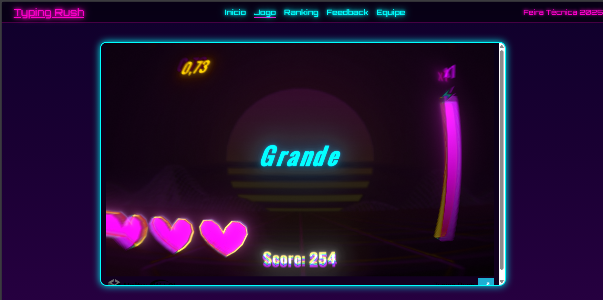
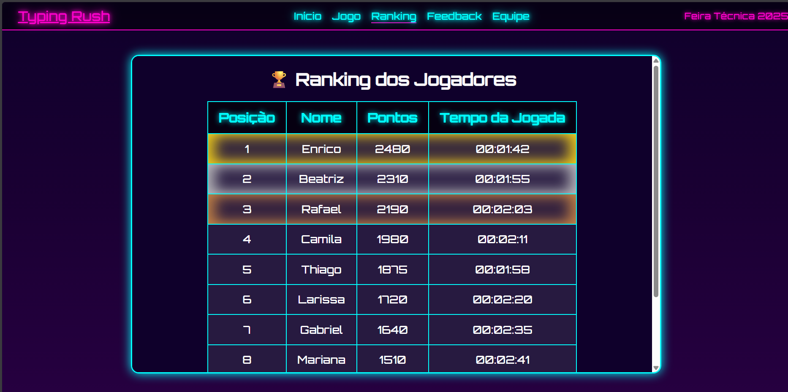
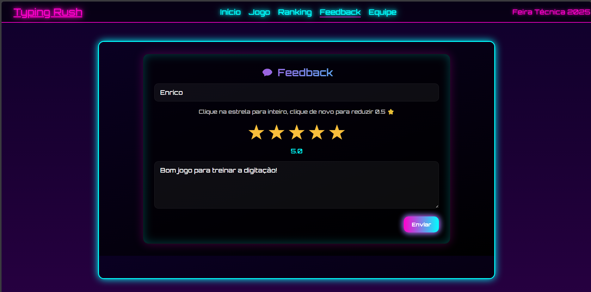

# ⌨️ Typing Rush

Jogo de teste de velocidade de digitação, desenvolvido em **Unity 2D** e integrado a um site com ranking online e sistema de feedback.

Projeto desenvolvido para a **Feira Técnica 2025 do Colégio Univap**.


## 📸 Preview





## 🎮 Sobre o jogo

Digite corretamente as palavras que aparecem na tela dentro do tempo limite. Acerte em sequência pra aumentar o multiplicador, ative o especial quando a barra encher, e tente chegar ao fim sem erros pra desbloquear o modo bônus "Hora dos Números".

- 4 níveis de dificuldade (Fácil, Médio, Difícil, Insano)
- Sistema de multiplicador e barra especial
- Modo bônus ao completar a partida sem erros
- Ranking online com os melhores tempos e pontuações
- Sistema de feedback com avaliação por estrelas

## 🛠️ Tecnologias

- Unity 2D (build WebGL)
- PHP + MySQL (ranking e feedback)
- HTML, CSS, JavaScript

## 🚀 Como rodar localmente

Pré-requisito: [XAMPP](https://www.apachefriends.org/) instalado.

1. Copie a pasta do projeto para `C:\xampp\htdocs\`
2. Inicie o **Apache** e o **MySQL** no painel do XAMPP
3. Acesse `http://localhost/phpmyadmin`, abra a aba SQL e execute o conteúdo de `SQL PRA USAR.txt`
4. Acesse `http://localhost/JogoTeclado/index.html`

## 📁 Estrutura

```
JogoTeclado/
├── assets/           # Imagens do site
├── jogo/             # Build WebGL do Unity
├── index.html        # Página principal (navegação por abas)
├── ranking.php        # Ranking online
├── feedback.php       # Formulário de avaliação
└── SQL PRA USAR.txt   # Script de criação do banco
```
